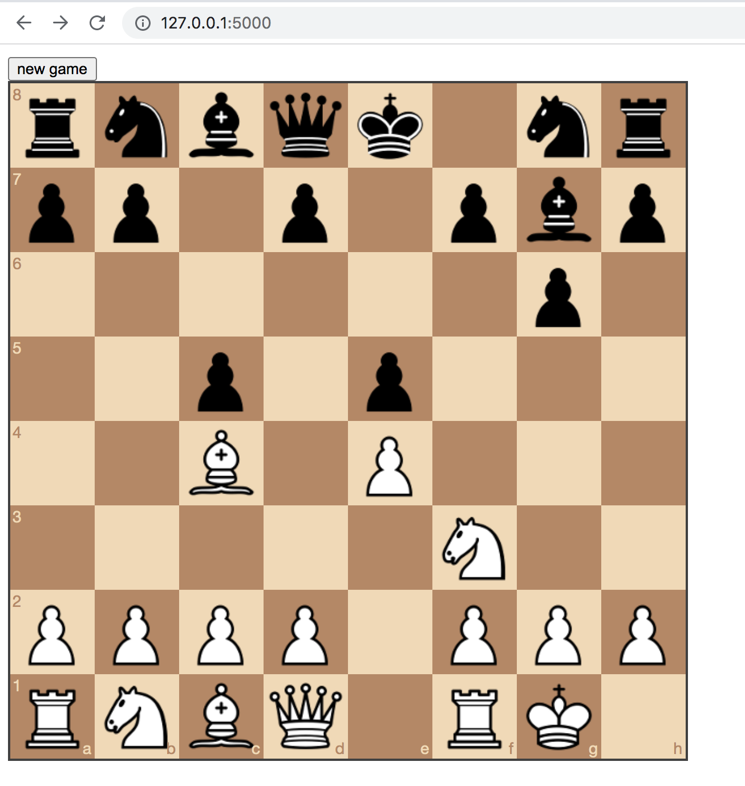

# Neural Chess

It's not the best chess engine, but it is a chess engine.

Proof of concept neural network chess engine (feed-forward multi-layer perceptron trained on Gary Kasaparov's [games](https://www.pgnmentor.com/)).

**Spoiler alert**: it does not play as well as Kasparov.... :laughing:

Naive goal of predicting probability of winning based on board position (i.e. during training, every move in a game that was won is considered a "good move", any move in a game that was lost is considered a "bad move", and moves from drawn games have no value.



# Installation
1. Install requirements with ```python3 -m pip install -r requirements.txt```
2. Run app with ```python3 play.py```

## Credits
Inspired by George Hotz' twitchchess [stream](https://www.youtube.com/watch?v=RFaFmkCEGEs)
